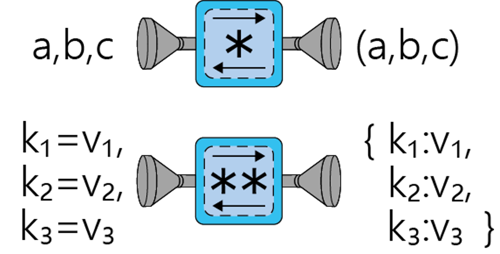

# An intuitive but comprehensive tutorial on \*args and \*\*kwargs to finally put your questions to rest

A short tutorial to understand and learn how to use \*args and \*\*kwargs in Python.

>TLDR; use ```\*args``` to pack/unpack tuples into the variable ```args``` and ```\*\*kwargs``` to pack/unpack dictionaries in the variable ```kwargs```



